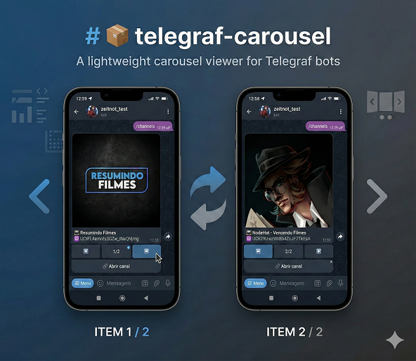

# 📦 telegraf-carousel

A lightweight, extensible **carousel viewer engine** for [Telegraf](https://telegraf.js.org/) Telegram bots.

Build interactive card viewers with **zero boilerplate**, automatic navigation handlers, and a flexible render system.

Perfect for displaying:

* 📺 Channels
* 📅 Events
* 🧾 Lists
* 🛒 Products
* 📊 Any paginated data

---

## ✨ Features

* ✅ No manual `bot.action` handlers required
* ✅ Automatic action namespacing (no conflicts)
* ✅ Fully customizable rendering
* ✅ Supports photo-based card navigation
* ✅ Multiple carousels can run simultaneously
* ✅ Designed for clean architecture and reuse

---

## 📥 Installation

```bash
npm install telegraf-carousel
```

> Requires `telegraf` v4+

---

## 🚀 Basic Usage



-

```js
const { Telegraf, Markup,session } = require('telegraf');
const { createCarousel } = require('telegraf-carousel');

const bot = new Telegraf(process.env.BOT_TOKEN);

bot.use(session());

// Example data
const data = [
  {
    channelId: 'UCtFL4emnfs3GZw_INeQNjmg',
    title: 'Resumindo Filmes',
    avatar: 'https://yt3.ggpht.com/-HGY_MEeY9RE4EHN3ik9pWCvHU3581uQlvRIX1Y7cGkaNWLGqzOke3mbJG_6o2QtjwcEZ0wnrw=s88-c-k-c0x00ffffff-no-rj-mo',
    url: 'https://www.youtube.com/channel/UCtFL4emnfs3GZw_INeQNjmg'
  },
  {
    channelId: 'UCR29U-ezWvBb4ZcJf7TbEsA',
    title: 'NodeHat - Vencendo Filmes',
    avatar: 'https://yt3.ggpht.com/M9ryGqFrq5BWSUMIwtHn9U454pTZsXu3PcBc6diJhY2WUmjmFzxZy9dQrKaOVJ_ZLN4i0Bim=s88-c-k-c0x00ffffff-no-rj-mo',
    url: 'https://www.youtube.com/channel/UCR29U-ezWvBb4ZcJf7TbEsA'
  }
];

// Create a carousel viewer
const channelViewer = createCarousel(bot, {
  id: 'channels',
  sessionKey: 'viewChannels',

  render: (item) => ({
    media: item.avatar,
    caption:
`📺 *${item.title}*
🆔 \`${item.channelId}\``
  }),

  buttons: (item) => [
    [Markup.button.url('🔗 Abrir canal', item.url)]
  ]
});

// Open carousel with a command
bot.command('channels', async (ctx) => {
  await channelViewer.open(ctx, data);
});

bot.launch();
```

---

## 🧠 How it Works

`telegraf-carousel` abstracts all navigation logic and message updates.

You only provide:

* `render()` → how each card looks
* `buttons()` → optional extra buttons
* `id` → unique carousel identifier
* `sessionKey` → where state is stored

Navigation actions are automatically registered internally.

---

## ⚙️ API

### `createCarousel(bot, options)`

Creates a new carousel instance.

#### Options

| Property                     | Type     | Required | Description                             |
| ---------------------------- | -------- | -------- | --------------------------------------- |
| `id`                         | string   | ✅        | Unique identifier for action namespace  |
| `sessionKey`                 | string   | ✅        | Key used to store list in session       |
| `render(item, index, total)` | function | ✅        | Returns `{ media, caption }`            |
| `buttons(item)`              | function | ❌        | Returns additional inline keyboard rows |

---

### `viewer.open(ctx, data)`

Opens the carousel and renders the first item.

---

## ⚠️ Common Errors

### ❌ `ReferenceError: Markup is not defined`

Make sure you import `Markup` from telegraf:

```js
const { Telegraf, Markup } = require('telegraf');
```

---

## 💡 Tips

* Use unique `id` values if you have multiple carousels.
* Your bot must have session middleware enabled.
* Captions use Telegram Markdown formatting.

---

## 📄 License

MIT
